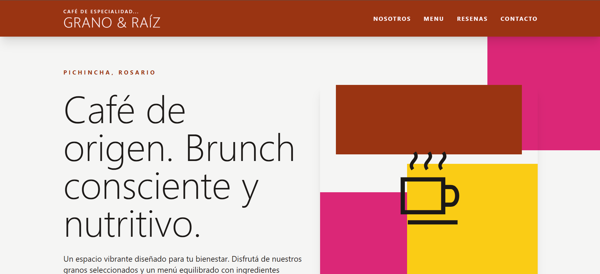
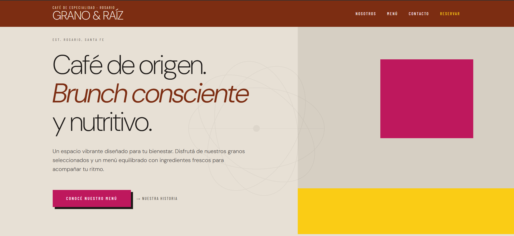

# Informe PFO2: Evaluación de Agentes de IA en el Desarrollo Frontend

**Estudiante:** Ayelen Diamela Cristi  
**Fecha:** Junio 2026

## 1. Introducción
El presente proyecto consiste en la ejecución de un *prompt* único de alta precisión para el diseño autónomo de una *Landing Page* (“Grano & Raíz”), con el objetivo de comparar el rendimiento, la interpretación estética y la adherencia a restricciones técnicas entre dos modelos de lenguaje distintos: **Codex (GPT-4o)** y **Claude (3.5 Sonnet)**.

## 2. Acceso al Proyecto
*   **Deploy Unificado (Vercel):** [https://pfo2-promptia.vercel.app/](https://pfo2-promptia.vercel.app/)

## 3. Especificaciones del Prompt
Rol: Desarrollador Frontend Senior.
Tarea: Maqueta index.html (HTML5 + Tailwind CSS CDN) para "Grano & Raíz" (cafetería en Rosario). Código final autónomo y responsivo. PROHIBIDO usar  (usa puro CSS, tipografía y SVG inline).

Estilo (Luis Barragán): Arquitectónico, minimalista, bloques geométricos (rounded-none), sombras duras (shadow-xl). Paleta: Fondo arena (bg-stone-100), acentos saturados (Rosa Mexicano bg-pink-600, Amarillo bg-yellow-400, Terracota bg-orange-800). Textos principales oscuros (text-stone-900). Fuente Sans-serif geométrica.

Estructura Estricta:

Header (Sticky): Fondo Terracota. Logo apilado tipográfico a la izq (arriba: "CAFÉ DE ESPECIALIDAD..." text-xs tracking-[0.2em], abajo "GRANO & RAÍZ" text-4xl font-light). Enlaces a la der en mayúsculas (text-pink-50, hover: tachado line-through).

Hero: H1 exacto: "Café de origen. Brunch consciente y nutritivo." Subtítulo: "Un espacio vibrante diseñado para tu bienestar. Disfrutá de nuestros granos seleccionados y un menú equilibrado con ingredientes frescos para acompañar tu ritmo." Botón CTA: "Conocé nuestro Menú" (enlace href="#menu").

Nosotros: 2 columnas. Izq: Bloque geométrico sólido Rosa Mexicano con frase destacada. Der: Texto breve sobre calidad/ambiente.

Menú (ID menu): Tipográfico, mucho aire (márgenes grandes, sin tarjetas). 3 Categorías (tracking-widest): CAFÉ DE ESPECIALIDAD, BRUNCH & LONCHERÍA, PASTELERÍA. 3 ítems por categoría con nombre en negrita y descripción. CERO PRECIOS.

Testimonios: 3 reseñas (texto y nombre). Formato: bloques geométricos contiguos (rounded-none), cada uno con un color de fondo distinto (rosa, amarillo, terracota claro).

Contacto: 2 columnas. Izq: Horarios ("Mar a Dom, 9 a 20 hs"). Der: Formulario maquetado. Campos con bordes rectos/gruesos (border-2 border-stone-900), al hacer focus cambia el borde a color vibrante. Botón CTA sólido con sombra dura.

Footer: Bloque oscuro (bg-stone-900, text-stone-50). Dirección ficticia (Pichincha, Rosario), redes sociales (íconos SVG inline estrictamente).

## 4. Análisis Comparativo de Resultados
La evaluación se realizó bajo los mismos parámetros, permitiendo identificar cómo los modelos interpretan y priorizan las restricciones del prompt:

*   **Codex (GPT-4o) - Enfoque en Consistencia Técnica:**
    *   **Adherencia a restricciones:** Alta. Siguió la estructura solicitada, priorizando la semántica y la robustez del código.
    *   **Gestión de estilos:** Código conservador y estándar, ideal para mantenimiento, pero con una interpretación lineal de las instrucciones de diseño.
    *   **Comportamiento Responsivo:** Implementó la adaptabilidad de forma estándar; el layout se ajusta correctamente, aunque con una jerarquía de elementos menos optimizada para pantallas móviles.

*   **Claude (3.5 Sonnet) - Enfoque en Intención Estética y Diseño:**
    *   **Adherencia a restricciones:** Alta, con una capacidad superior para interpretar conceptos abstractos.
    *   **Criterio visual:** Aplicó la intención del espacio negativo y volúmenes, logrando un impacto visual superior y mayor fidelidad a la identidad "estilo Luis Barragán".
    *   **Comportamiento Responsivo:** Presenta una resolución más fluida; Claude demuestra un mejor manejo de los *breakpoints* de Tailwind, asegurando que la identidad visual "arquitectónica" se preserve tanto en *desktop* como en dispositivos móviles sin perder la alineación de los bloques.

**Conclusión técnica:** Mientras que Codex se consolida como una herramienta eficiente para la construcción de estructuras robustas y escalables, Claude destaca como un co-diseñador capaz de elevar el look and feel del producto. La elección entre ambos modelos no depende de su capacidad técnica —la cual es alta en ambos casos—, sino de la naturaleza del proyecto: Codex es ideal cuando la prioridad es la predictibilidad y la estandarización, mientras que Claude es la opción superior cuando el objetivo es lograr una identidad visual definida y una ejecución de diseño con mayor sensibilidad estética.

## 5. Evidencia Visual
Las siguientes capturas documentan el estado final de las interfaces generadas sin intervención manual:

### Agente: Codex (GPT-4o)

### Agente: Claude (3.5 Sonnet)
